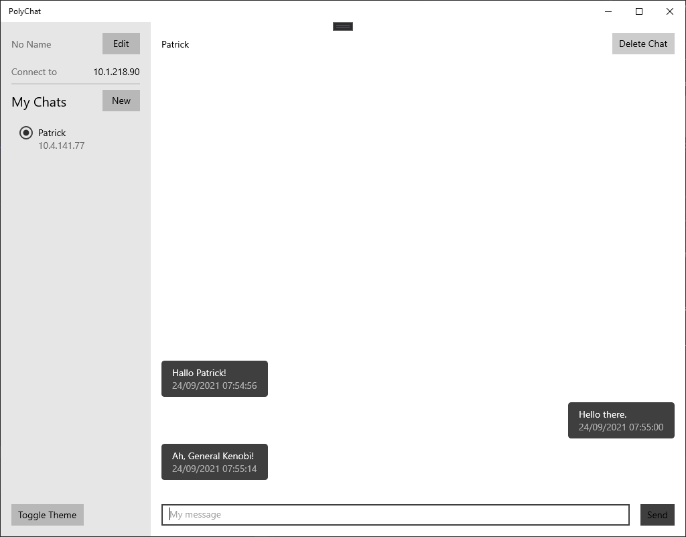
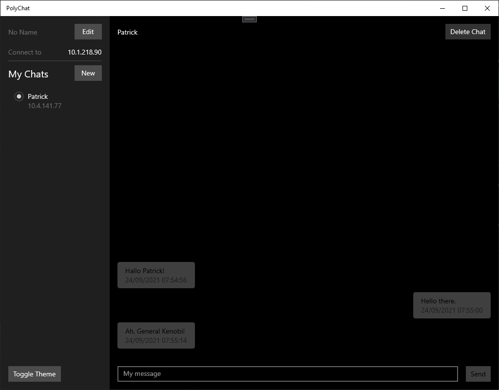

# Polychat 

serverless chat app written in c# using [`SocketIOSharp`](https://github.com/uhm0311/SocketIOSharp) & `UWP`

### Features:
- chat is not dependent on server, every client can be a server
- chatpartner discovery over ip address
- set username to be shown to chatpartners
- save chat history to local disk (encrypted)
- dark mode ;)

### Implentation:
- network connection via the library [`SocketIOSharp`](https://github.com/uhm0311/SocketIOSharp)
- graphical user interface uses `UWP` (Universal Windows App)
- messages are sent via json
- chat history gets saved as json after encryption

### Screenshots:

